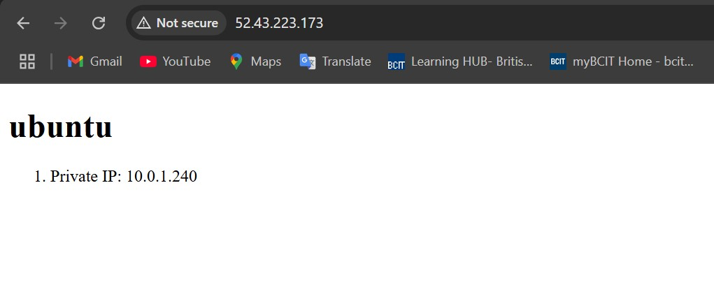
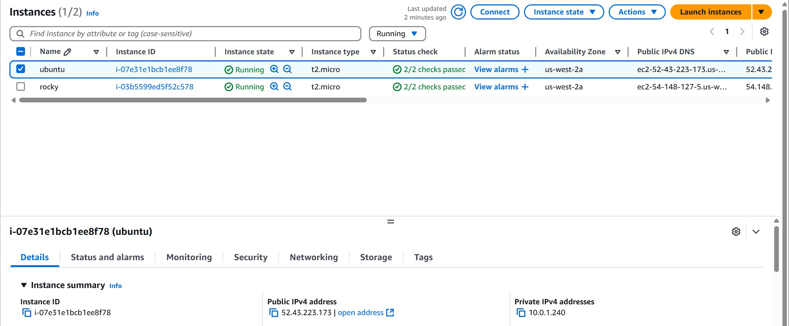

# 4640-w11-lab-start-w25

# Labweek11

### Deploy infrastructure with Terraform:
```
cd terraform
terraform init
terraform apply --auto-approve
```

### Make sure that you have python3-boto3 instaaled. You might need to install boto3 otherwise you will receive an error while trying to run ansbile palybook:
```
sudo apt update
sudo apt install python3-boto3
```

### Run the Ansible Playbook:
```
cd ansible
ansible-playbook -i inventory/aws_ec2.yml playbook.yml
```

### Screenshots:



